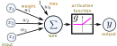
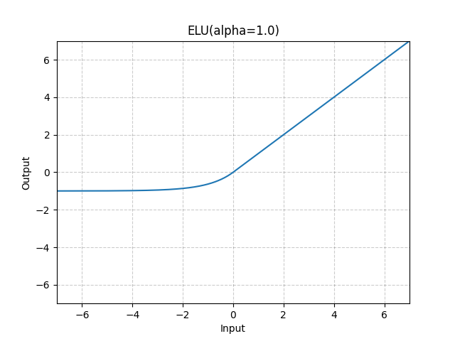
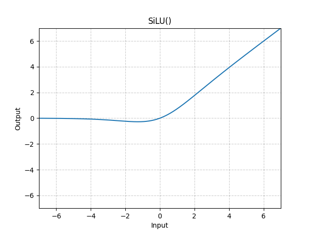
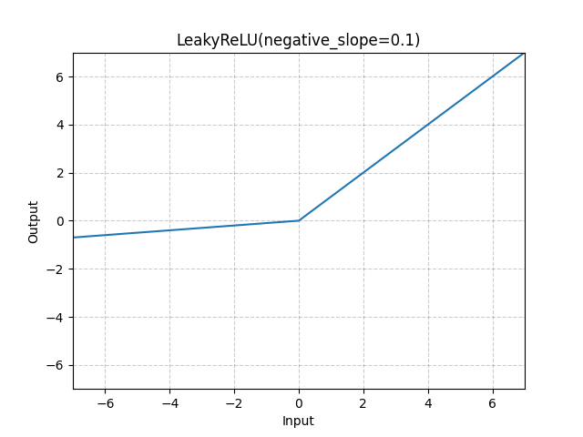
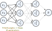

<style>
@import 'bootstrap/css/bootstrap.min.css';
@import 'style.css';
</style>

# Optimization - Gradient descent
### Grégoire Passault

---

<!-- header: "Gradient descent" -->
# Gradient descent

---

## Gradient descent

Previously, we see how to solve linear systems of equations (exactly, or approximately).

<span data-marpit-fragment>

**Problem**: How to find $w$ when $f(w)$ is not linear?

</span>


---

## Gradient

Suppose we have a function $f: \mathbb{R}^n \to \mathbb{R}$.

<span data-marpit-fragment>

Let's take for example a function of two variables $x = \begin{bmatrix} x_1 \\ x_2 \end{bmatrix}$.

</span>

<span data-marpit-fragment>

In that case, the linear approximation becomes:

$$
f(x)
\approx
f(x_0)
+
\frac{df}{dx_1} \Delta x_1
+
\frac{df}{dx_2} \Delta x_2
$$

<div class="alert alert-info">

**Note**: the derivatives above are taken at $x_0$.

</div>

</span>

---

## Gradient

In matrix form:

$$
f(x)
\approx
f(x_0)
+
\underbrace{
\begin{bmatrix}
\frac{df}{dx_1} &&
\frac{df}{dy_2}
\end{bmatrix}
}_{\nabla f^T}
\begin{bmatrix}
\Delta x_1 \\
\Delta y_2
\end{bmatrix}
$$

We call $\nabla f$ the **gradient** of $f$.

---

## Computing the gradient

For example, let's take $f(x) = cos(x_1) + 2 x_2 x_1 - x_2^2$.

<div class="alert alert-primary">

⚙️ What is $\nabla f$, the gradient of $f$?

</div>

<span data-marpit-fragment>

$$
\nabla f
=
\begin{bmatrix}
\frac{df}{dx_1} \\
\frac{df}{dx_2}
\end{bmatrix}
=
\begin{bmatrix} -\sin(x_1) + 2 x_2 \\ 2 x_1 - 2 x_2 \end{bmatrix}
$$

</span>

---

## Gradient descent

<div class="alert alert-info">

Suppose we want to minimize $f(x)$.
**Idea**: start at $x_0$, and iteratively update $x$ by taking small steps.

</div>

<span data-marpit-fragment>

The gradient provides a local, linear approximation of f:

$$
f(x) \approx f(x_0) + \nabla f^T \Delta x
$$

It gives the direction of the **steepest** ascent (or descent) of $f$.

</span>

---

## Gradient descent

The algorithm is then:

1. Select an initial guess $x_0$.
2. Compute the gradient $\nabla f(x_0)$.
3. Update $x$ by taking a small step in the opposite direction of the gradient:
   $x_{k+1} = x_k - \alpha \nabla f(x_k)$.
4. Repeat until convergence.

<div class="alert alert-info" data-marpit-fragment>

$\alpha$ is called the **learning rate**.

</div>

---

## Gradient descent

<center>
<video src="imgs/gradient_steps.mp4" width="800" controls />
</center>

---

## Gradient descent

<div class="alert alert-success">

We can now find the $w$ that minimizes $f(w)$, even when $f$ is not linear.

</div>

<span data-marpit-fragment>

Problem remains:
- What model $f(x, w)$ to use ? 
- How to compute the gradient $\nabla f$ ?
- How to choose/adjust the learning rate $\alpha$ ?
- How to tackle over/underfitting ?

</span>

---

<!-- header: "Perceptron" -->
# Perceptron

---

## Perceptron

A **perceptron** is a function modelling a neuron, with the following architecture:

<center>

</center>

---

## Perceptron

The output of the perceptron is:

$$
y = g(w_0 + \sum w_i x_i)
$$

Where:

* $x_i$ are the inputs,
* $w_i$ are the weights,
* $w_0$ is the bias,
* $g$ is the activation function.

---

## Activation functions

The goal of the activation function is to introduce **non-linearity** in the model.

---

## Activation functions

<div class="row">
<div class="col-sm-4 p-1">

</div>
<div class="col-sm-4 p-1">

</div>
<div class="col-sm-4 p-1">

</div>
<div class="col-sm-4 p-1">

</div>
<div class="col-sm-4 p-1">

</div>
<div class="col-sm-4 p-1">

</div>
</div>

</div>

---

<!-- header: "Neural networks" -->
# Neural networks

---

## Neural networks

In a neural network, multiple perceptrons are combined in layers:

<center>

</center>

Here, each $z$ is a perceptron.

---

## Neural network

We call this a **multi-layer perceptron** (MLP).
The layers are **fully connected**.

<center>

</center>

---

## Weights

<center>

</center>

---

## Weights

<center>

</center>

---

## Weights

<center>

</center>

---

## Weights

<center>

</center>


---

<!-- header: "Learning" -->
# Learning

---

## Loss function

<div class="card m-1">
<div class="card-header">
Categorical cross-entropy
</div>
<div class="card-body">

$$
\mathcal{L}(w) = - \sum_{i=1}^n y_i \log(f(x_i, w))
$$

</div>
</div>

<div class="card m-1">
<div class="card-header">
Mean squared error
</div>
<div class="card-body">

$$
\mathcal{L}(w) = \frac{1}{n} \sum_{i=1}^n (y_i - f(x_i, w))^2
$$

</div>
</div>

---

## Mini-batches

In practice, we don't compute the loss over the whole dataset at each iteration. Instead, we use **mini-batches**.

<span data-marpit-fragment>

For example, we will sample $B = {i_1, i_2, \ldots, i_k}$ indices, and compute the loss over these samples:

$$
\mathcal{L}(w) \approx \frac{1}{| B |} \sum_{i \in B} \mathcal{L}(w, x_i, y_i)
$$

</span>

<span data-marpit-fragment>

We call an **epoch** a full pass over the dataset.

</span>

---

## Training and validation

When learning, we want to avoid **overfitting**.

To achieve this, the typical strategy is to split the dataset into **training** and **validation** sets.

<div class="alert alert-info" data-marpit-fragment>

For example, 80% of the data is used for training, and 20% for validation.

</div>

---

## Training and validation

By monitoring the loss on the validation set, we can detect overfitting:

<center>

</center>

---

## Optimizer

The gradient descent as presented before is not used in practice. Many extra features are added to improve convergence.

<span data-marpit-fragment>

The most common optimizer is the [Adam optimizer](https://pytorch.org/docs/stable/generated/torch.optim.Adam.html#torch.optim.Adam).

</span>
<span data-marpit-fragment>

It mostly adds **momentum** and **adaptive learning rates**.

</span>

---

<!-- header: "PyTorch" -->
# PyTorch

---

## PyTorch

PyTorch is a popular library for deep learning. It provides:

* Tensors (like Numpy arrays) with GPU support,
* Automatic differentiation (computing gradients),
* Neural network layers,
* Optimizers,
* ...

---

## Learning a simple function

Let's first write a module for multi-layer perceptron (`mlp.py`):

```python
import torch as th

# Defining a simple MLP
class MLP(th.nn.Module):
    def __init__(self, input_dimension: int, output_dimension: int):
        super().__init__()

        self.net = th.nn.Sequential(
            th.nn.Linear(input_dimension, 256),
            th.nn.ELU(),
            th.nn.Linear(256, 256),
            th.nn.ELU(),
            th.nn.Linear(256, 256),
            th.nn.ELU(),
            th.nn.Linear(256, output_dimension),
        )

    def forward(self, x):
        return self.net(x)
```

---

## Learning a simple function

We will then create some (nosiy) data:

```python
import numpy as np

xs = np.linspace(0, 6, 1000)
ys = np.sin(xs)*2.5 + 1.5 + np.random.randn(1000)*0.1
```

<center>

</center>

---

## Learning a simple function

Those data needs to be transformed into PyTorch tensors:

```python
import torch as th

xs = th.tensor(xs, dtype=th.float).unsqueeze(1)
ys = th.tensor(ys, dtype=th.float).unsqueeze(1)
```

---

## Learning a simple function

We can now create our MLP and the optimizer:

```python
from mlp import MLP

# Creating the network and optimizer
net = MLP(1, 1)
optimizer = th.optim.Adam(net.parameters(), 1e-3)
```

---

## Learning a simple function

Finally, we can train our model:

```python
# Training the model
for epoch in range(512):
    # Compute the loss
    loss = th.nn.functional.mse_loss(net(xs), ys)

    # Computing the gradient and updating weights
    optimizer.zero_grad()
    loss.backward()
    optimizer.step()
    print(f"Epoch {epoch}, loss={loss.item()}")
```

---

## Learning a simple function

Putting it all together, and adding some plotting, we get the [example code](https://github.com/Gregwar/optimization/blob/main/code/learn_example.py):

<center>
<video src="imgs/learn_steps.mp4" width="600" controls />
</center>

---

## Learning a simple function

Plotting the loss over time:

<center>
<video src="imgs/learn_loss.mp4" width="600" controls />
</center>

---

## Let's practice

[PanTilt exercise](https://rhoban.github.io/reperes/tp_pantilt)