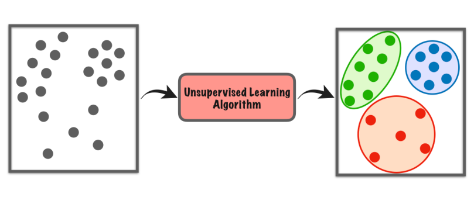
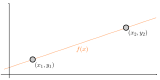
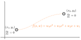
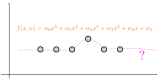
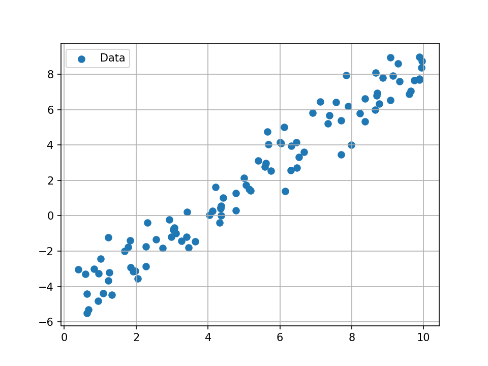

<style>
@import 'bootstrap/css/bootstrap.min.css';
@import 'style.css';
</style>

# Supervised learning
## Grégoire Passault


---

<!-- header: "Introduction" -->
# Introduction

---

## Machine Learning

Machine learning is often divided into three categories

* Supervised learning
* Unsupervised learning
* Reinforcement learning

---

<div class="card m-1">
<div class="card-header">
⭐ Supervised learning ⭐
</div>
<div class="card-body">
Given some example input and outputs, the goal is to learn a function that maps inputs to outputs.
<hr/>

</div>
</div>

---

<div class="card m-1">
<div class="card-header">
Unsupervised learning
</div>
<div class="card-body">
Given some data, the goal is to learn the underlying structure of the data.
<hr/>

</div>
</div>

---

<div class="card m-1">
<div class="card-header">
Reinforcement learning
</div>
<div class="card-body">
By interacting with an environment, the goal is to learn a policy that maximizes a reward.
<hr/>

</div>
</div>

---

## Supervised learning

**Input**:
A dataset $\mathcal{D} = \{ (x_i, y_i) \}_{i=1}^n$ where $x_i$ is the input and $y_i$ is the output.

<span data-marpit-fragment>

**Output**:
A function $y = f(x)$ that maps inputs to outputs.

</span>

<span data-marpit-fragment>

<div class="alert alert-info">

If the output is a continuous value, we call this a **regression** problem, if it is a category (like `cat` or `dog`), we call this a **classification** problem.

</div>

</span>

---

### Method

<div class="card m-1" data-marpit-fragment>
<div class="card-header">
Step 1: choose a model
</div>
<div class="card-body">

We first choose a model $y = f(x, w)$, which is a specific function that depends on some parameters $w$.

</div>
</div>

<div class="card m-1" data-marpit-fragment>
<div class="card-header">
Step 2: choose a metric
</div>
<div class="card-body">

We then decide a metric to evaluate how well the model is performing.

</div>
</div>

<div class="card m-1" data-marpit-fragment>
<div class="card-header">
Step 3: train the model
</div>
<div class="card-body">

Finally, we search for the parameters $w$ that minimize the metric on the dataset $\mathcal{D}$.

</div>
</div>

---

## Outline

<table class="table table-striped">

<thead>
    <tr>
        <th>
        Approach
        </th>
        <th>
        Pros
        </th>
        <th>
        Cons
        </th>
    </tr>
</thead>

<tr>
    <td>
    Exact solution
    </td>
    <td class="text-success">
    Efficient
    </td>
    <td class="text-danger">
    Solvable equations, overfitting
    </td>
</tr>
<tr>
    <td>
    Least square
    </td>
    <td class="text-success">
    Efficient
    </td>
    <td class="text-danger">
    Linear model, quadratic error
    </td>
</tr>
<tr>
    <td>
    Netwon's method
    </td>
    <td class="text-success">
    Any model
    </td>
    <td class="text-danger">
    Suboptimal, can diverge
    </td>
</tr>
<tr>
    <td>
    Gradient descent
    </td>
    <td class="text-success">
    Any model
    </td>
    <td class="text-danger">
    Suboptimal, slow
    </td>
</tr>

</table>

---

<!-- header: "Linear models" -->
# Linear models

---

## Linear models

Linear models are those of the forms:

$$
f(x, w) = \sum w_i g_i(x)
$$

Where $g_i$ are some functions of the input $x$.

<div class="alert alert-info" data-marpit-fragment>

Note: the models are linear in the parameters $w$, and not in the input $x$.

</div>

---

## Examples

<div class="alert alert-primary">

⚙️ Which models are linear ?

</div>

<div class="row">

<div class="col-sm-6 p-1">
<div class="card">

$f(x) = w_2 x + w_1$

</div>
</div>
<div class="col-sm-6 p-1">
<div class="card">

$f(x) = w_3 x^2 + w_2 x + w_1$

</div>
</div>
<div class="col-sm-6 p-1">
<div class="card">

$f(x) = cos(w_1 x) + 3 sin(w_2 x)$

</div>
</div>
<div class="col-sm-6 p-1">
<div class="card">

$f(x) = w_1 cos(x) + w_2 sin(3x)$

</div>
</div>
<div class="col-sm-6 p-1">
<div class="card">

$f(x) = w_1 e^{-x} + w_2 x^4 - 5$

</div>
</div>
<div class="col-sm-6 p-1">
<div class="card">

$f(x) = w_1^x + w_2 tan(x) - w_3$

</div>
</div>
<div class="col-sm-6 p-1">
<div class="card">

$f(x) = w_1 x + w_2 x$

</div>
</div>
<div class="col-sm-6 p-1">
<div class="card">

$f(x) = w_1 w_2 x + w_2 x^2$

</div>
</div>

</div>


---

## Examples

<div class="alert alert-primary">

⚙️ Which models are linear ?

</div>

<div class="row">

<div class="col-sm-6 p-1">
<div class="card bg-success text-white">

$f(x) = w_2 x + w_1$

</div>
</div>
<div class="col-sm-6 p-1">
<div class="card bg-success text-white">

$f(x) = w_3 x^2 + w_2 x + w_1$

</div>
</div>
<div class="col-sm-6 p-1">
<div class="card bg-danger text-white">

$f(x) = cos(w_1 x) + 3 sin(w_2 x)$

</div>
</div>
<div class="col-sm-6 p-1">
<div class="card bg-success text-white">

$f(x) = w_1 cos(x) + w_2 sin(3x)$

</div>
</div>
<div class="col-sm-6 p-1">
<div class="card bg-success text-white">

$f(x) = w_1 e^{-x} + w_2 x^4 - 5$

</div>
</div>
<div class="col-sm-6 p-1">
<div class="card bg-danger text-white">

$f(x) = w_1^x + w_2 tan(x) - w_3$

</div>
</div>
<div class="col-sm-6 p-1">
<div class="card bg-success text-white">

$f(x) = w_1 x + w_2 x$

</div>
</div>
<div class="col-sm-6 p-1">
<div class="card bg-danger text-white">

$f(x) = w_1 w_2 x + w_2 x^2$

</div>
</div>

</div>

---

<!-- header: "Exact solutions" -->
# Exact solutions

---

## Exact solutions

Given some dataset, we can first search for a solution that **exactly** fits the data.

<span data-marpit-fragment>

In that case, $f(x, w) = y$ for all $(x, y) \in \mathcal{D}$.

</span>

<span data-marpit-fragment>

<br/>

<div class="alert alert-info">

This approach is especially useful for **interpolation**.

</div>

</span>

---

## Affine fitting

Let's start with the simplest example:

<center>

</center>

<div class="alert alert-primary">

⚙️ What is the model ? How to find $w$ ?

</div>

---

## Affine fitting

First, let's define the model:

$$
f(x, w) = w_2 x + w_1
$$

We can then write the equations:

$$
\begin{align*}
f(x_1, w) &= y_1 \\
f(x_2, w) &= y_2
\end{align*}
$$

---

## Affine fitting

This yields the system of equations:

$$
\begin{align*}
w_2 x_1 + w_1 &= y_1 \\
w_2 x_2 + w_1 &= y_2
\end{align*}
$$

<span data-marpit-fragment>

In matrix form:

$$
\underbrace{
\begin{bmatrix}
1 & x_1 \\
1 & x_2
\end{bmatrix}
}_A
\underbrace{
\begin{bmatrix}
w_1 \\
w_2
\end{bmatrix}
}_w
=
\underbrace{
\begin{bmatrix}
y_1 \\
y_2
\end{bmatrix}
}_b
$$

</span>

---

## Affine fitting

The solution is then:

$$
w = A^{-1} b
$$

---

## Cubic fitting

We can also impose derivatives:

<center>

</center>

<div class="alert alert-primary">

⚙️ What are $A$ and $b$ ?

</div>

---

## Cubic fitting

We have:

$$
\begin{align*}
f(x, w) = w_4 x^3 + w_3 x^2 + w_2 x + w_1 \\
f'(x, w) = 3 w_4 x^2 + 2 w_3 x + w_2
\end{align*}
$$

<span data-marpit-fragment>

Then:

$$
\underbrace{
\begin{bmatrix}
1 & x_1 & x_1^2 & x_1^3 \\
1 & x_2 & x_2^2 & x_2^3 \\
0 & 1 & 2 x_1 & 3 x_1^2 \\
0 & 1 & 2 x_2 & 3 x_2^2
\end{bmatrix}
}_A
\begin{bmatrix}
w_1 \\
w_2 \\
w_3 \\
w_4
\end{bmatrix}
=
\underbrace{
\begin{bmatrix}
y_1 \\
y_2 \\
0 \\
0
\end{bmatrix}
}_b
$$

</span>

---

## Quintic fitting

Now, what if we have 6 data points and want to find a model ?

<center>

</center>

<div class="alert alert-primary">

⚙️ How do you expect $f(x, w)$ to look like ?

</div>

---

## Quintic fitting

The [output](https://github.com/Gregwar/supervised_learning/blob/main/code/quintic_fit.py) will look like this:

<center>

</center>

---

## Quintic fitting

We can notice the following: 

* With exact solution, we need **as much parameters as data points**
* The model is **overfitting** the data, and will likely perform poorly on new data

---

<!-- header: "Least squares" -->
# Least squares

---

## Linear regression

Suppose we have many data points and wand to find $f$:

<center>

</center>

---

## Linear regression

If we write the system as seen before:

$$
\underbrace{
\begin{bmatrix}
1 & x_1 \\
1 & x_2 \\
\vdots & \vdots \\
1 & x_n 
\end{bmatrix}
}_A
\begin{bmatrix}
w_1 \\
w_2
\end{bmatrix}
=
\underbrace{
\begin{bmatrix}
y_1 \\
y_2 \\
\vdots \\
y_n
\end{bmatrix}
}_b
$$

<div class="alert alert-danger">

Problem: $A$ is not square, so we cannot invert it.
This is because we only have **two** parameters, but **many** data points.

</div>

---

## Minimizing an error

<div class="alert alert-warning">

**Idea:** instead of finding $w$ that exactly fits the data, we can find $w$ that minimizes an error.

</div>

<span data-marpit-fragment>

We will call this error $\mathcal{L}(w)$.
The most common error is the **least squares** error:

$$
\mathcal{L}(w) = \sum_{i=1}^n (f(x_i, w) - y_i)^2
$$

</span>

---

## Minimizing an error

We then want to find $w$ that minimizes $\mathcal{L}(w)$:

$$
w^* = \arg\min_w \mathcal{L}(w)
$$

---

## Least squares

We have a **linear** model and a **square** error.
$\mathcal{L}(w)$ is then a **quadratic** function of $w$:

<center>

</center>

<div class="alert alert-success" data-marpit-fragment>

$w^*$ is obtained where **all** the derivatives of $\mathcal{L}(w)$ is zero.

</div>

---

## Back to linear regression

Back to the linear regression problem:

$$
\begin{align*}
f(x, w) = w_2 x + w_1 \\
\mathcal{L}(w) = \sum_{i=1}^n (f(x_i, w) - y_i)^2
\end{align*}
$$

<div class="alert alert-primary">

⚙️ Can you find an equation to find $w_1$ and $w_2$ ?

</div>

---

## Solving linear regression

First, let's write $L(w) = \sum_{i=1}^n (w_2 x_i + w_1 - y_i)^2$

We can expand it to:

$$
L(w) = \sum_{i=1}^n (w_2^2 x_i^2 + w_1^2 + y_i^2 - 2 w_2 x_i y_i - 2 w_1 y_i + 2 w_1 w_2 x_i)
$$

Then, we can compute the derivatives with respect to $w_1$ and $w_2$:

$$
\begin{align*}
\frac{\partial L}{\partial w_1} &= 2 \sum_{i=1}^n (w_2 x_i + w_1 - y_i) \\
\frac{\partial L}{\partial w_2} &= 2 \sum_{i=1}^n x_i (w_2 x_i + w_1 - y_i)
\end{align*}
$$

---

## Solving linear regression

To cancel the derivatives, we then have:

$$
\begin{align*}
w_2 \sum  x_i + n w_1 - \sum y_i  = 0\\
w_2 \sum x_i^2 + w_1 \sum x_i - \sum x_i y_i = 0
\end{align*}
$$

---

## Solving linear regression

Thus:

$$
w_1 = \frac{\sum y_i - w_2 \sum x_i}{n} 
$$

Substitute in the second equation:

$$
w_2 \sum x_i^2 + \frac{1}{n} \sum x_i \sum y_i - w_2 \frac{1}{n} \sum x_i \sum x_i = \sum x_i y_i
$$

---

## Solving linear regression

This yields:

$$
w_2 = \frac{n \sum x_i y_i - \sum x_i \sum y_i}{n \sum x_i^2 - (\sum x_i)^2}
$$

$$
w_1 = \frac{\sum y_i - w_2 \sum x_i}{n} 
$$

---

## Example

We can then write [some code](https://github.com/Gregwar/supervised_learning/blob/main/code/linear_regression_naive.py) to solve the linear regression problem:

<center>

</center>

---

## A more general form

Remember that we can write the exact form equation as:

$$
A w = b
$$

<span data-marpit-fragment>

The loss function is then:

$$
\mathcal{L}(w) = (A w - b)^T (A w - b)
$$

</span>

---

## A more general form

This expands to:

$$
\mathcal{L}(w) = w^T A^T A w - 2 w^T A^T b + b^T b
$$

<span data-marpit-fragment>

The derivatives can then be computed as:

$$
\frac{\partial \mathcal{L}}{\partial w} = 2 A^T A w - 2 A^T b
$$

</span>

---

## A more general form

Setting the derivative to zero yields:

$$
A^T A w = A^T b
$$

<span data-marpit-fragment>

And thus:

$$
w = \underbrace{(A^T A)^{-1} A^T}_{A^\dagger} b
$$

</span>

---

## A more general form

<div class="alert alert-success">

The least square solution can then be obtained with the **exact same** approach as the exact solution.

$A^{-1}$ is replaced by $A^\dagger = (A^T A)^{-1} A^T$.

</div>

<div class="alert alert-info" data-marpit-fragment>

$A^\dagger$ is called the **pseudo-inverse** of $A$.

```python
import numpy as np
np.linalg.inv(A) # inverse
np.linalg.pinv(A) # pseudo-inverse
```

</div>

---

## Linear regression with pseudo-inverse

We can then write [some code](https://github.com/Gregwar/supervised_learning/blob/main/code/linear_regression_pseudo_inverse.py) using `numpy.linalg.pinv` to solve the linear regression problem. Yielding the same result:

<center>

</center>

---

<!-- header: "Practical exercices" -->
# Practical exercices

---

## Let's write some Python!

On the next slide, you will find **data** and **models**.

<div class="alert alert-primary">

⚙️ Using the [linear regression example](https://github.com/Gregwar/supervised_learning/blob/main/code/linear_regression_pseudo_inverse.py), you can write some code to find the [parameters used](https://github.com/Gregwar/supervised_learning/blob/main/code/least_square_generate_data.py)!

<hr/>

*Hint*: to load the data, you can use:

```python
import numpy as np
data = np.loadtxt('data.csv')
```

</div>

---

## Let's write some Python!

<div class="row">

<div class="col-sm-6 p-1">
<div class="card text-center">
<div class="card-body">
    <center>
    <a href="data/data_0.csv"></a>
    </center>

$f(x) = w_1 x + w_2$

</div>
</div>
</div>

<div class="col-sm-6 p-1">
<div class="card text-center">
<div class="card-body">
    <center>
    <a href="data/data_1.csv"></a>
    </center>

$f(x) = w_1 x^2 + w_2 x + w_3$

</div>
</div>
</div>


<div class="col-sm-6 p-1">
<div class="card text-center">
<div class="card-body">
    <center>
    <a href="data/data_2.csv"></a>
    </center>

$f(x) = w_1 cos(x) + w_2 x + w_3$

</div>
</div>
</div>

<div class="col-sm-6 p-1">
<div class="card text-center">
<div class="card-body">
    <center>
    <a href="data/data_3.csv"></a>
    </center>

$f(x) = w_1 log(x) + w_2 sin(x)$

</div>
</div>
</div>

</div>

---

## Practical case: identifying a RR robot

Let us consider the following RR robot:

<center>

</center>

$(x_b, y_b)$: position of its base. $l_1, l_2$: lengths of its arms.
$(\alpha, \beta)$: angles of its arms. $(x_e, y_e)$: position of its end-effector.

<div class="alert alert-primary">

⚙️ Can you express $(x_e, y_e)$ as function of other variables ?

</div>

---

## Practical case: identifying a RR robot

We have:

$$
\begin{align*}
x_e &= x_b + l_1 \cos(\alpha) + l_2 \cos(\alpha + \beta) \\
y_e &= y_b + l_1 \sin(\alpha) + l_2 \sin(\alpha + \beta)
\end{align*}
$$

<div class="alert alert-info mt-2" data-marpit-fragment>

The model is linear in the parameters $(x_b, y_b, l_1, l_2)$.

</div>

---

## Practical case: identifying a RR robot

Here are some [data](data/rr_data.csv) generated with this [script](https://github.com/Gregwar/supervised_learning/blob/main/code/rr_data.py).

They contain noisy measurements of $(x_e, y_e)$ for different values of $(\alpha, \beta)$.

```python
import numpy as np
data = np.loadtxt('data/rr_data.csv')
alpha, beta, x_e, y_e = data[0] # first data
```

<div class="alert alert-primary mt-2">

⚙️ Write some code to retrieve parameters $(x_b, y_b, l_1, l_2)$.

</div>