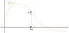
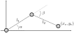

# Optimization - Netwon's method
### Grégoire Passault

---

<!-- header: "Newton's method" -->
# Newton's method

---

## Newton's method

We already saw how to solve linear systems of equations, solving them approximately with least squares, and how to use gradient descent to solve optimization problems.

**Problem**: How to solve $f(x) = 0$, for any function $f$?

---

## Newton's method

We could create an error function $e(x) = f(x)^2$, and use gradient descent to minimize it. 

We will see another method, called **Newton's method**.

---

## Newton's method

Here is an example of a non-linear function $f(x)$.

---

## Newton's method

First, we select an initial guess $x_0$.

---

## Newton's method

We compute $y_0$ = $f(x_0)$.

---

## Newton's method

We can then approximate $f(x)$ by its tangent at $x_0$.

---

## Newton's method

We can then solve for the approximation.

---

## Newton's method

And start again with the new initial guess.

---

## Newton's method

And start again with the new initial guess.

---

## Newton's method

And start again with the new initial guess.

---

## Newton's method: algorithm

The algorithm can then be summarized as follows:

1. Select an initial guess $x_0$.
2. Compute $y_0 = f(x_0)$.
3. Compute the tangent at $x_0$.
4. Solve for the approximation $x_1 = x_0 - f'(x_0) y_0$.
5. Start again with the new initial guess $x_1$, until convergence.

---

## A simple example

Let's consider the function $f(x) = x^2 + x - 2$.

⚙️ Apply 5 steps of Newton's method to find a root of $f(x)$.
Try different initial guesses $x_0 = -5$ and $x_0 = 5$.

---

## A simple example

Here are the intermediate expected steps, using $x_0 = -5$:

---

## A simple example

Here are the intermediate expected steps, using $x_0 = 5$:

---

<!-- header: "Multi dimensional case" -->
# Multi dimensional case

---

## Gradient

Remember the gradient of a function $f: \mathbb{R}^n \to \mathbb{R}$:

$$
\nabla f = \begin{bmatrix} \frac{\partial f}{\partial x_1} \\ \vdots \\ \frac{\partial f}{\partial x_n} \end{bmatrix}
$$

---

## Jacobian

If we now have $f: \mathbb{R}^n \to \mathbb{R}^m$, what is the derivative of $f$?

For example, for $f: \mathbb{R}^2 \to \mathbb{R}^2$.
Say $(y_1, y_2) = f(x_1, x_2)$.

$$
f(x)
\approx
f(x_0)
+
\underbrace{
\begin{bmatrix}
\frac{\partial y_1}{\partial x_1} && \frac{\partial y_1}{\partial x_2} \\
\frac{\partial y_2}{\partial x_1} && \frac{\partial y_2}{\partial x_2}
\end{bmatrix}
}_J
\begin{bmatrix}
\Delta x_1 \\
\Delta x_2
\end{bmatrix}
$$

$J$ is called the **Jacobian** of $f$. We can also write $J = \frac{\partial f}{\partial x}$.

---

<!-- header: "Application on the RR robot" -->
# Application on the RR robot

---

## RR robot

Remember the RR robot model:

---

## RR robot

The position for the end-effector is:

$$
\begin{align*}
x_e &= l_1 \cos(\alpha) + l_2 \cos(\alpha + \beta) \\
y_e &= l_1 \sin(\alpha) + l_2 \sin(\alpha + \beta)
\end{align*}
$$

⚙️ What is the Jacobian of the end-effector position with respect to the joint angles $\alpha$ and $\beta$ ?

---

## RR robot

The Jacobian is:

$$
J
=
\begin{bmatrix}
\frac{\partial x_e}{\partial \alpha} && \frac{\partial x_e}{\partial \beta} \\
\frac{\partial y_e}{\partial \alpha} && \frac{\partial y_e}{\partial \beta}
\end{bmatrix}
$$

---

## RR robot

The Jacobian is:

$$
J
=
\begin{bmatrix}
-l_1 \sin(\alpha) - l_2 \sin(\alpha + \beta) && -l_2 \sin(\alpha + \beta) \\
l_1 \cos(\alpha) + l_2 \cos(\alpha + \beta) && l_2 \cos(\alpha + \beta)
\end{bmatrix}
$$

---

## RR robot

We can now use Newton's method to solve for the joint angles $\alpha$ and $\beta$ for a given target position $(x_t, y_t)$!